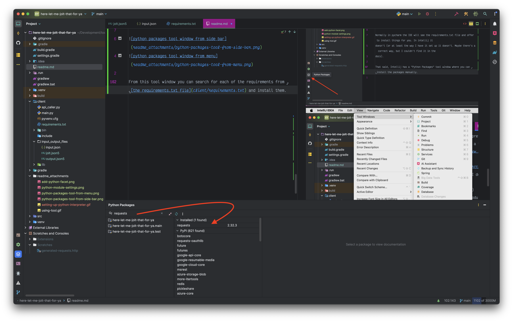

# Here, let me jolt that for you

## :exhausted: why this tool exists

Troubleshooting jolt documents is a pain in the ass. It's a functional pipeline where the inputs and outputs of steps
are invisible to you, so when we build massive jolt docs with lots of steps and temporary variables in the middle it
makes it wildly frustrating to troubleshoot.

So, after trying several different methods of troubleshooting jolts that we don't have unit tests for I landed on this
as a tool for making the best of a bad situation.

## What it is

In addition to the explanation
below, [we did an overview of this tool](https://nielsenenterprise.sharepoint.com/:v:/r/sites/LIEngineering/Shared%20Documents/signoff_jolt%20tooling-20241119_133223-Meeting%20Recording.mp4?csf=1&web=1&e=u2H00w&nav=eyJyZWZlcnJhbEluZm8iOnsicmVmZXJyYWxBcHAiOiJTdHJlYW1XZWJBcHAiLCJyZWZlcnJhbFZpZXciOiJTaGFyZURpYWxvZy1MaW5rIiwicmVmZXJyYWxBcHBQbGF0Zm9ybSI6IldlYiIsInJlZmVycmFsTW9kZSI6InZpZXcifX0%3D)
during a ticket sign off process and recorded it. There are some additional details in there about navigating around
symbols, explaning what the jolt version actually means and what it _should mean_ in context of our apis vs customer
apis, practical examples of executing the tool, stuff like that. If you're planning on using this tool it's worth
watching or at least skimming through the video at 2x speed.

This codebase is a toolset for testing out and troubleshooting a jolt document fired against a given input. The output
of the transformation is written to a json file, pretty printed, so you can review the output. Really, it's
like a local version of [the online jolt tester tool](https://jolt-demo.appspot.com/#inception), but it has a couple of
key advantages:

- There's no request size limitation
    - The online tool limits the size of the requests and our products and jolt's are so big they don't work with the
      online tool without modification
- We're in an IDE, so we can take advantage of all of the features an IDE gives (syntax highlighting, structure
  navigation, keyboard shortcuts, etc)
- The server is local and launched via intellij, so you can run it with the debugger
    - Sometimes jolts fail on the server side, so it's nice to be able to pause and see what's going on while the
      transformation is being run
- The jolt input file is a json5 file, not regular json
    - This is key, because json5 allows you to add comments, so you can comment out steps to see what the output of the
      transformation is part of the way through the file.
    - The comments also allow you to add notes to the jolt as you troubleshoot it
- It's independent of our product-model-transformation tooling
    - Here you can concentrate on just the jolt transformation vs all of the other layers TAP adds

## How to use it

The basic steps are:

- Clone the codebase
- Run the gradle refresh to install the dependencies
- Install the python dependencies
    - This can be done via the command palette or python tool window
- Start the java app
    - The project settings are saved to the codebase, so you should be able to just launch it
- update your input_output_files
    - input.json should contain the json you want to transform (likely the indexed product json)
    - jolt.json5 should be your jolt document containing all of the transformation steps
- open the output.json file, this is where the output of the transformation will be dumped
- Run the python script in `./client/main.py`

I tend to open the input output files in different splits so I can modify the jolt, run the script, and see the output
immediately.

Once you're done troubleshooting the jolt you can copy the jolt out of the jolt.json5 file and put it wherever it's
supposed to go

**IMPORTANT: remember to strip out any json5 stuff like comments before you put the updated jolt wherever it needs to go
**.

# Intellij idiosyncrasies and workarounds

Intellij is kind of weird about shoving python into a kotlin project, either that or I did it kind of wrong :| It means
that there are a couple of steps you may need to do manually to make it work. If I can figure out how to correct it I'll
update the project, but for now you may have to do some manual steps.

## Adding the python interpreter

Normally if you use something like pycharm the IDE will walk you through getting the python interpreter and virtual
environment setup. Here you have to do it manually.

- Open your project settings -> Facets
- Click the `+` button to add a Python facet
  
- After the facet is added you should see a select dropdown that allows you to select an existing interpreter (i.e. the
  python executable).
    - If you don't get an interpreter in the list you can use the triple dot menu to select an interpreter from your
      computer.
    - If you don't have an interpreter installed on your computer already, you'll need to use a tool
      like [homebrew](https://brew.sh/) to install python, or if you're on windows install it
      from [the python website](https://www.python.org/downloads/windows/) (I don't know if windows has package managers
      now that I think of it :| )
- There should now be a Python module in your project settings Modules section. If there's not you can use the `+`
  button to add one and select the python interpreter you just set up.
  
- Once you click ok the python files should stop complaining about needing an interpreter (you may have to close and
  re-open the python file)

## Installing depdendencies

Normally in pycharm the IDE will see the requirements.txt file and offer to install things for you. In intellij it
doesn't (or at least the way I have it set up it doesn't. Maybe there's a correct way, but I couldn't find it in the
docs).

That said, Intellij has a "Python Packages" tool window where you can install the packages manually.

From this tool window you can search for each of the requirements
from [the requirements.txt file](client/requirements.txt) and install them.  

